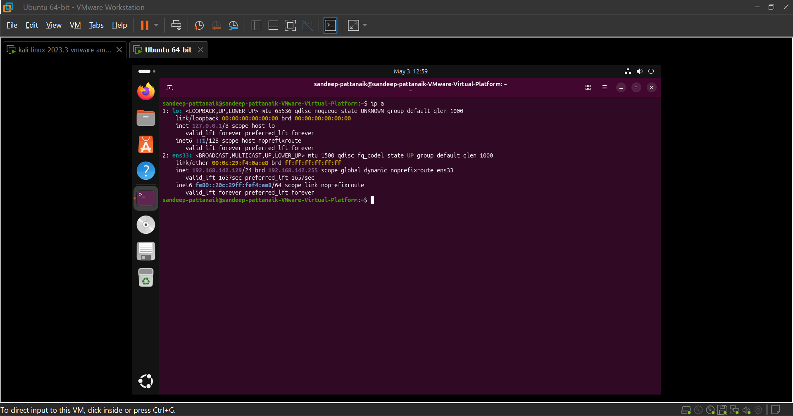
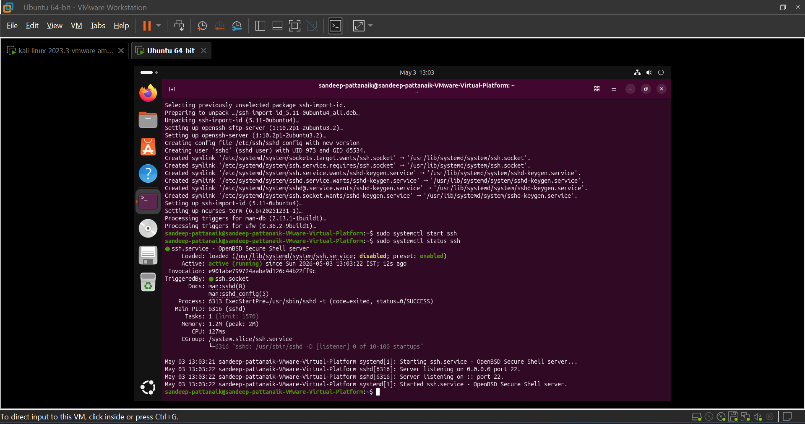
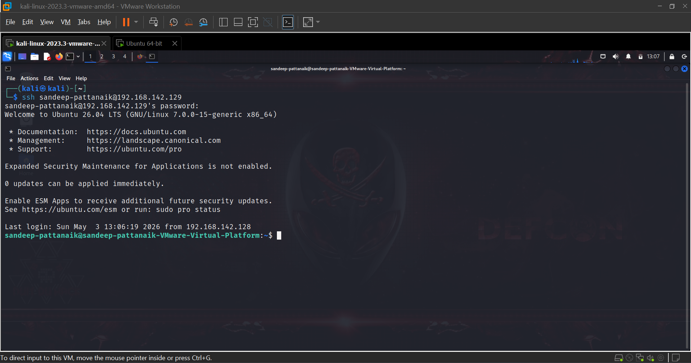
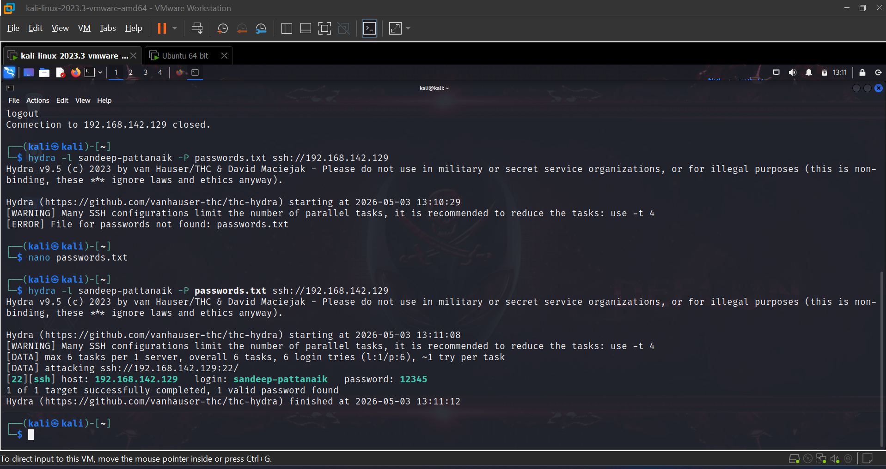
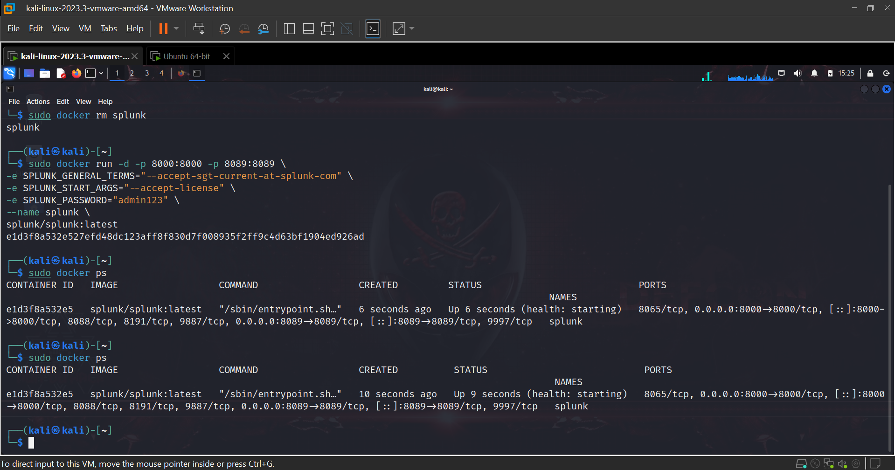
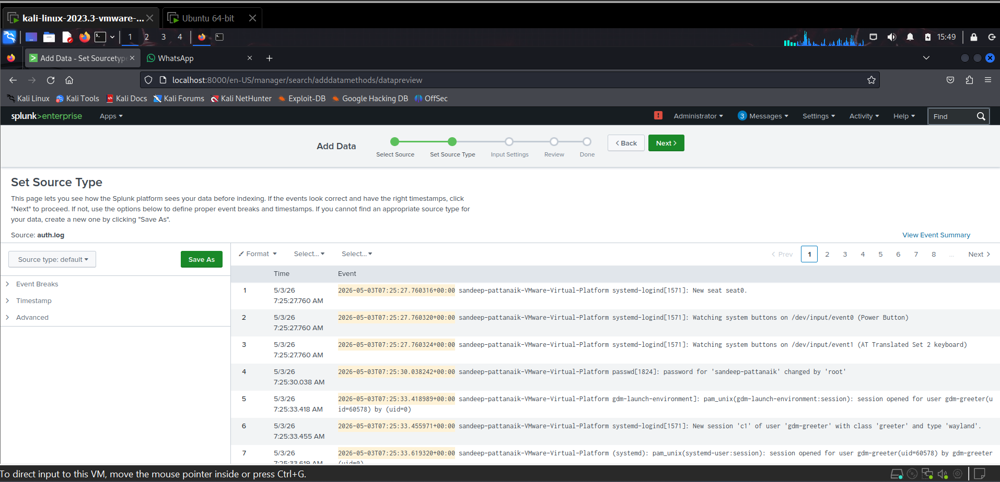
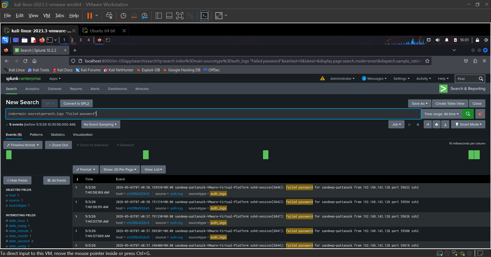
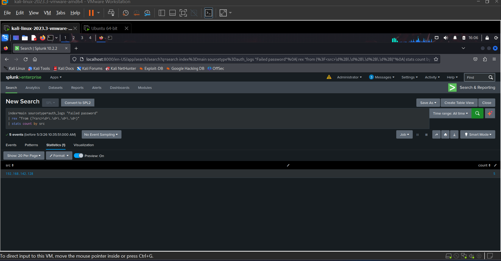
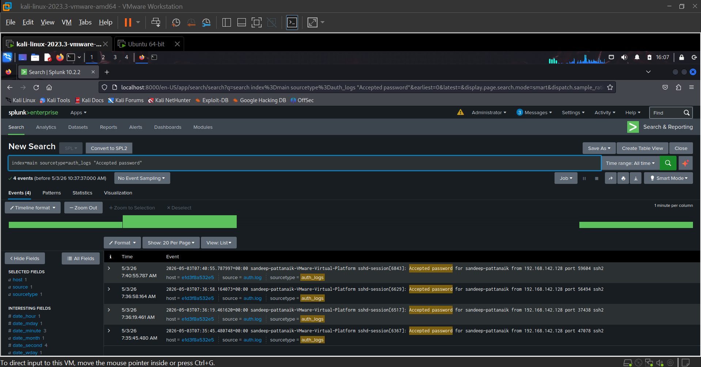

# 🔐 Splunk SIEM – Brute Force Attack Detection

## 📌 Project Overview

This project demonstrates how a **brute force SSH attack** can be detected using **Splunk SIEM**.
Logs are collected from an Ubuntu system and analyzed to identify multiple failed login attempts and attacker activity.

---

## 🛠️ Tools & Technologies

* Splunk Enterprise (SIEM)
* Ubuntu Linux (Target Machine)
* Kali Linux (Attacker Machine)
* Hydra (Brute Force Tool)
* SSH Logs (`auth.log`)

---

## ⚙️ Project Workflow

### 1️⃣ Target System Setup



---

### 2️⃣ SSH Service Running



---

### 3️⃣ SSH Login Attempt



---

### 4️⃣ Brute Force Attack using Hydra



---

### 5️⃣ Splunk Setup



---

### 6️⃣ Data Ingestion (auth logs)



---

### 7️⃣ Failed Login Detection



---

### 8️⃣ Attacker IP Identification



---

### 9️⃣ Successful Login Detection



---

## 🔍 Splunk Query Used

```spl
index=main sourcetype=auth_logs "Failed password"
| rex "from (?<src>\d+\.\d+\.\d+\.\d+)"
| stats count by src
```

---

## 🚨 Detection Logic

* Multiple failed login attempts from same IP
* Extraction of attacker IP using `rex`
* Aggregation using `stats count`
* Identification of brute force pattern

---

## 🎯 Key Learnings

* Log analysis using Splunk
* Detection of brute force attacks
* Understanding SSH authentication logs
* Creating SIEM detection queries

---

## 📌 Conclusion

This project showcases how SIEM tools like Splunk can effectively detect brute force attacks by analyzing authentication logs and identifying suspicious patterns.

---
